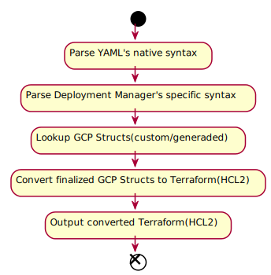

# deploymentmanager-tf(Deployment Manager -> Terraform)    

## Description    

A Conversion tool from Deployment Manager to Terraform    

**NOTE:** The tool is aim for converting the deployment manager yaml based file, not the live deployment manager resource    

## [Resources](./RESOURCES.md)    

## Architecture     

- Start being Deployment Manager's yaml    

- End being Terraform(HCL2)    

    

## Todo    

- [ ] Base YAML parsing to HCL2    
- [ ] GCP Resources reading    
- [ ] Function parsing(deployment manager func refs)    
- [ ] Using protobuf for GCP structs?    
- [ ] more...

## Authors
- [juliosueiras](https://github.com/juliosueiras)
- [mccallry](https://github.com/juliosueiras)
